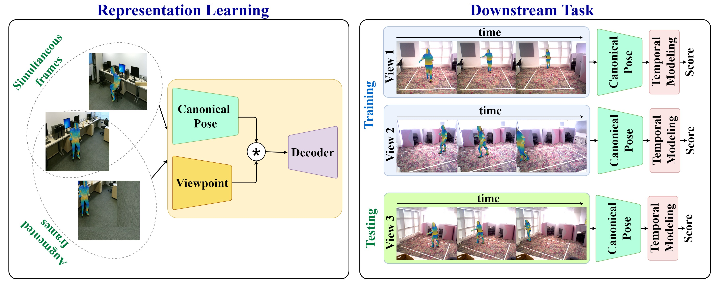

   

We obtain PyTorch implementations for 'Unsupervised View-Invariant Human Posture Representation'.

[Project Page]() |  [Arxiv](https://arxiv.org/pdf/2109.08730.pdf) |  [BibTex](https://arxiv.org/pdf/2109.08730.pdf) 

## Prerequisites
- Linux 
- Python 3
- CPU or NVIDIA GPU + CUDA CuDNN

## BibTex
@article{sardari2021unsupervised,\\
  title={Unsupervised View-Invariant Human Posture Representation},\\
  author={Sardari, Faegheh and Ommer, Bj{\"o}rn and Mirmehdi, Majid},\\
  journal={arXiv preprint arXiv:2109.08730},\\
  year={2021}
}
